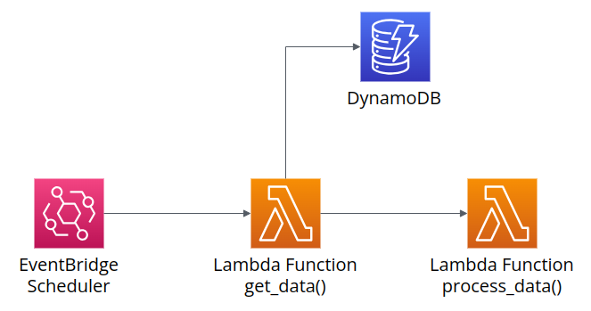

# Deploying AWS CloudFormation Stack with Github Actions

## About this repository

This repository demonstrates how to deploy an AWS CloudFormation stack using Github Actions.  
The goal is to have a fully automated deployment process that is triggered by a push to the main branch.

## Architecture of the AWS infrastructure

In this repo, we are deploying a simple AWS infrastructure that consists like the following image.
This architecture will be expressed in a **CloudFormation template** and deployed using **Github Actions**.

## Prerequisites

- AWS Account
- Github Account

## Writing the CloudFormation template

Just by deploying a CloudFormation stack, we can create the resources we need in AWS.
In this section, we will write a CloudFormation template that creates the resources shown in the architecture above.

### CloudFormation base template

